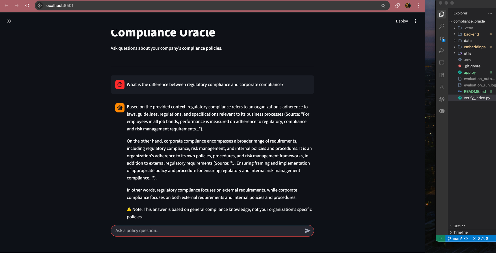
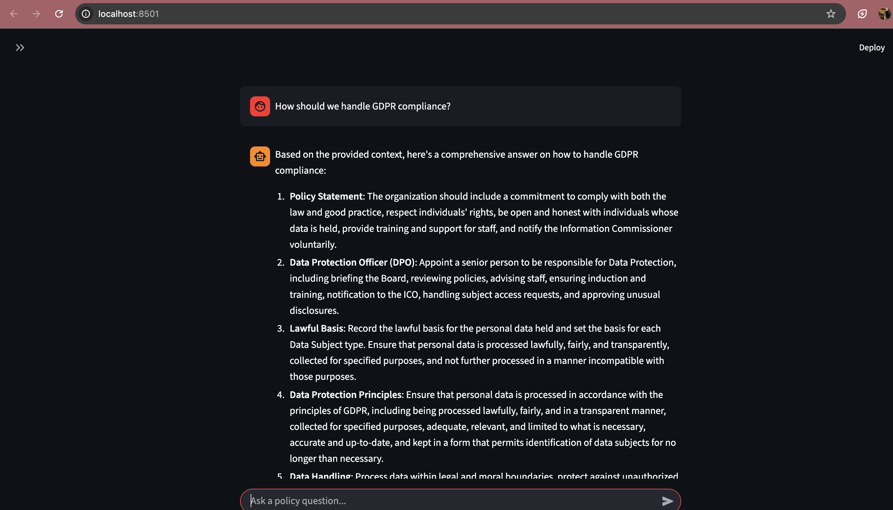

# Compliance Oracle (RAG Demo)

This is a **Retrieval-Augmented Generation (RAG)** system designed to answer questions about corporate compliance policies using a local knowledge base with intelligent fallback to general compliance knowledge.

##  How it Works
1.  **Ingestion**: Documents in `data/` are loaded, chunked (1500 chars with 300-char overlap), and embedded into a vector database (ChromaDB).
2.  **Retrieval**: Retrieves top 5 most relevant policy chunks using semantic search.
3.  **Hybrid Generation**: 
    - **Primary**: Answers from your organization's specific policies
    - **Fallback**: Uses LLM general compliance knowledge with clear disclaimer when documents lack information

##  Tech Stack
-   **LangChain**: RAG orchestration framework
-   **ChromaDB**: Vector storage (1230+ embedded chunks)
-   **HuggingFace Embeddings**: `sentence-transformers/all-MiniLM-L6-v2`
-   **LLM APIs**: Groq (Llama 3.1-8B) with OpenAI (GPT-4o-mini) fallback

##  Key Features
-   ✅ **Smart Context Detection**: Prioritizes organization-specific documents
-   ✅ **Hybrid RAG**: Falls back to general knowledge when needed
-   ✅ **Source Attribution**: Clear disclaimers distinguish policy vs general answers
-   ✅ **Optimized Retrieval**: 1500-char chunks for complete context
-   ✅ **Robust LLM Fallback**: Automatically switches to OpenAI if Groq fails

##  How to Run

### 1. Setup Environment
Create a `.env` file with your API keys:
```env
GROQ_API_KEY=your_groq_api_key_here
OPENAI_API_KEY=your_openai_api_key_here  # Optional fallback
```
**Note**: You need at least one API key. The system will use Groq first, then fall back to OpenAI if needed.

### 2. Ingest Data (Build Index)
Run this only if you add new documents to `data/`.
```bash
python backend/ingest_data.py
```

### 3. Run the Bot (Web Interface)
This starts the web-based chat interface.
```bash
streamlit run app.py
```

### 4. Advanced Evaluation (Optional)
For testing accuracy metrics (RAGAS):
```bash
python backend/evaluate_rag.py
```

## Examples

### Example 1


### Example 2

